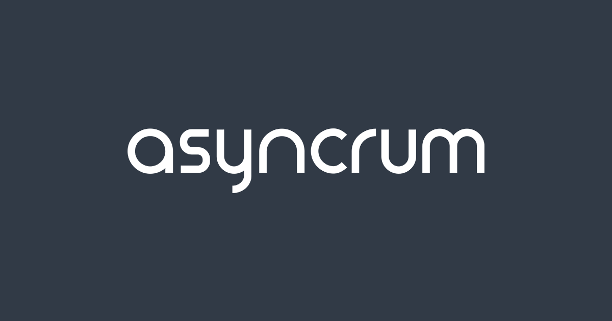

# Asyncrum Backend Deployment Manifest

> 이 성과는 2022년도 과학기술정보통신부의 재원으로 정보통신기획평가원의 지원을 받아 수행된 연구임. (IITP-2022-SW마에스트로과정)    This work was supported by the Institute of Information & Communications Technology Planning & Evaluation(IITP) grant funded by the Ministry of Science and ICT(MSIT) (IITP-2022-SW Maestro training course).

## 목차

- [1. Manifest 구조](#1-manifest-구조)
- [2. API Server CI/CD WorkFlow](#2-api-server-cicd-workflow)

## 1. Manifest 구조

- asyncrum-api: Asyncrum API 서버의 K8s 형상 배포를 위한 K8s yaml 파일들이 존재합니다.
- jitsi-helm: Jitsi Central K8s 형상 배포를 위한 Helm Chart 저장소입니다.
- jitsi-kompose: Jitsi Central Docker Compose → K8s yaml 변환 과정을 위한 kompose와 변환된 K8s yaml 파일들이 존재합니다.
- jenkins: Asyncrum API 서버의 CI를 위한 Jenkins Pipeline Script가 존재합니다.

## 2. API Server CI/CD WorkFlow

API Server의 CI/CD WorkFlow Ver 2.0는 다음과 같습니다

1. 깃허브 main 브랜치에 변경사항 발생
2. 깃허브가 웹훅을 Jenkins 서버에 전달
3. Jenkins 서버는 main 브랜치를 pull 받아 gradle을 통해 test 및 build 명령 실행
4. Gradle이 test 및 build 수행 후 Jar 파일 생성
5. 생성된 Jar 파일을 Docker image로 build
6. 생성된 Docker image를 Dockerhub로 전송
7. Jenkins 서버가 manifest 레포지토리를 pull 받아 deployment.yaml 파일의 image 버전을 갱신 후 push
8. ArgoCD가 manifest 레포지토리의 변경을 감지한 후 해당 manifest pull
9. ArgoCD는 K8s에게 새로운 manifest 변경점 sync
10. K8s는 변경된 manifest를 기반으로 새로운 image를 Dockerhub에서 pull
11. K8s에서 새로운 pods 배포
